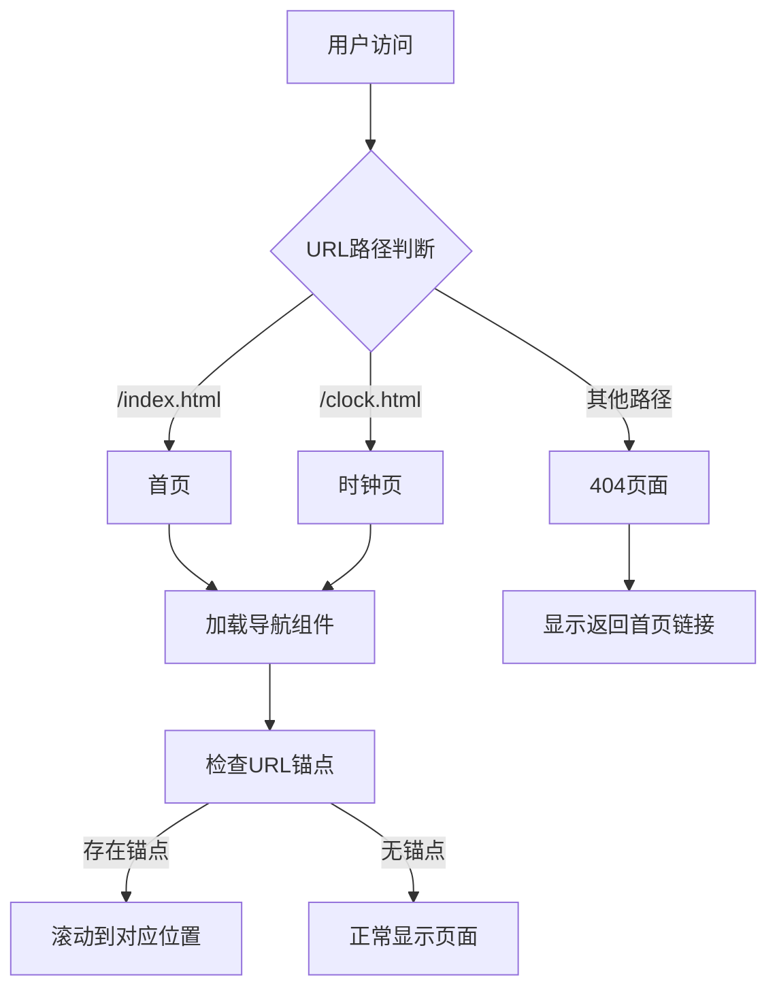

# 静态网站路由实施方案

## 方案概述
本方案实现传统页面跳转路由机制，保留锚点功能同时添加跨页面导航：
- 创建可复用导航组件 (`components/navbar.html`)
- 所有页面集成导航组件
- 添加跨页面锚点支持
- 优化404页面体验



## 实施步骤

### 1. 创建导航组件
- 文件路径: `components/navbar.html`
- 内容:
```html
<header class="bg-white/80 backdrop-blur-md sticky top-0 z-50 shadow-sm">
    <nav class="container mx-auto px-6 py-4 flex justify-between items-center">
        <a href="index.html" class="text-2xl font-bold text-slate-900">IhyaH</a>
        <div class="hidden md:flex space-x-6">
            <a href="index.html#about">关于我</a>
            <a href="index.html#projects">我的项目</a>
            <a href="index.html#contact">联系我</a>
            <a href="clock.html">时钟工具</a>
        </div>
        <a href="https://github.com/IhyaH" target="_blank" class="...">
            <i class="fab fa-github"></i>
            <span>GitHub</span>
        </a>
    </nav>
</header>
```

### 2. 页面集成导航组件
修改以下文件，在`<body>`标签后添加：
```html
<div id="navbar-container"></div>

<script>
    // 动态加载导航组件
    fetch('components/navbar.html')
        .then(res => res.text())
        .then(html => {
            document.getElementById('navbar-container').innerHTML = html;
        });
</script>
```
需修改文件：
- `index.html`
- `clock.html`
- `404.html`
- `Engineering-Budget-Study-Tool.html`
- `Interactive-Practice-for-Engineering-Estimation-and-Budgeting.html`

### 3. 添加跨页面锚点支持
在以下文件的`</body>`前添加脚本：
```javascript
// 跨页面锚点支持
window.addEventListener('DOMContentLoaded', () => {
    const hash = window.location.hash;
    if (hash) {
        // 等待导航加载完成
        setTimeout(() => {
            const target = document.querySelector(hash);
            if (target) {
                target.scrollIntoView({ behavior: 'smooth' });
            }
        }, 300);
    }
});
```
需修改文件：
- `index.html`
- `clock.html`

### 4. 优化404页面
修改`404.html`，在内容区域添加：
```html
<div class="text-center mt-12">
    <a href="index.html" class="text-indigo-600 hover:text-indigo-800 text-lg">
        <i class="fas fa-arrow-left mr-2"></i>返回首页
    </a>
</div>
```

## 测试方案
1. 导航功能测试
   - 首页 → 时钟页
   - 时钟页 → 首页
   - 任意页 → GitHub（外部链接）

2. 锚点功能测试
   - 首页直接访问`#projects`
   - 从时钟页跳转至首页`#contact`

3. 404处理测试
   - 访问不存在的路径
   - 验证返回首页链接

## 后续建议
1. 添加页面激活状态指示（当前页面导航高亮）
2. 实现移动端响应式导航菜单