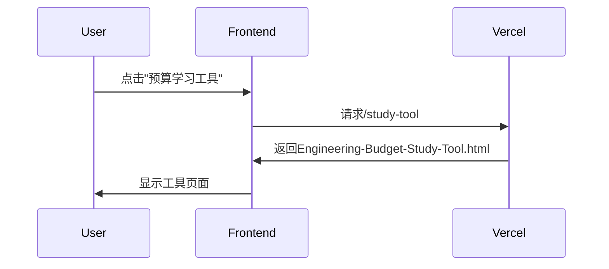

# Vercel路由实现方案

## 目标
为所有页面实现统一导航系统，支持多页应用路由

## 文件修改清单

### 1. 主页导航添加 (`index.html`)
```diff
<nav class="container mx-auto px-6 py-4 flex justify-between items-center">
  ...
  <div class="hidden md:flex space-x-6">
    <a href="#about">关于我</a>
    <a href="#projects">我的项目</a>
    <a href="#contact">联系我</a>
+   <a href="/study-tool">预算学习工具</a>
+   <a href="/practice">概预算练习</a>
  </div>
</nav>
```

### 2. 工具页返回导航 (`Engineering-Budget-Study-Tool.html`)
```html
<!-- 在<body>开头添加 -->
<header class="bg-white/80 backdrop-blur-md sticky top-0 z-50 shadow-sm">
  <nav class="container mx-auto px-6 py-4">
    <a href="index.html" class="text-blue-600 hover:text-blue-800 flex items-center">
      <i class="fas fa-arrow-left mr-2"></i>返回主页
    </a>
  </nav>
</header>
```

### 3. Vercel路由配置 (`vercel.json`)
```json
{
  "rewrites": [
    {
      "source": "/study-tool",
      "destination": "/Engineering-Budget-Study-Tool.html"
    },
    {
      "source": "/practice",
      "destination": "/Interactive-Practice-for-Engineering-Estimation-and-Budgeting.html"
    }
  ]
}
```

## 实施流程


## 预期效果
- 主页新增工具导航项
- 工具页面有返回主页按钮
- 支持友好URL访问